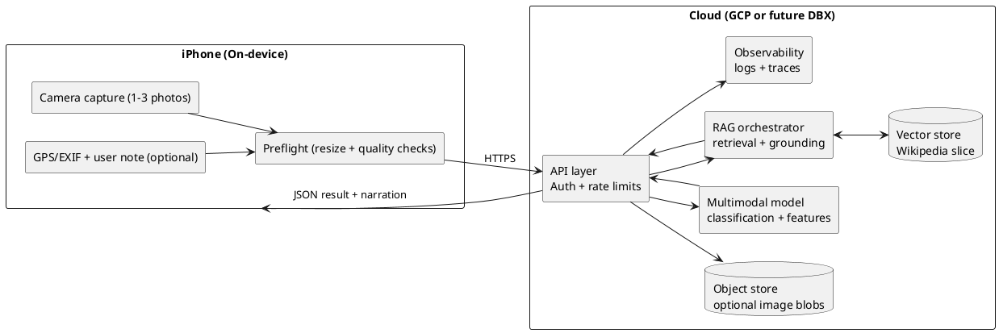

# Camera -> Geology (iPhone -> Cloud) Architecture Notes

This document describes a camera-first workflow for the future iOS app. The core idea is to keep the camera experience fast and to keep the explanation grounded in retrieved sources.

## What we are trying to do

Input
- One or more photos (wide shot + close-up).
- Optional metadata: GPS (with user consent), compass heading, timestamp, short user note.

Output
- Structured classification:
  - top hypotheses with confidence
  - visible features (texture, layering, fractures)
  - follow-up questions and photo requests
  - citations for background explanations
- A short narration derived from the structured result

Non-goals
- Safety-critical decisions (slope stability, rockfall risk).
- Guaranteed identification from a single photo.

## Reference architecture (cloud-first)

## Where agentic Wikipedia fits

1. Vision model proposes top candidates and visible features.
2. Orchestrator generates Wikipedia queries from those candidates.
3. Retrieval returns a small slice of citations.
4. Final explanation is grounded in retrieved sources.

This separation lets the vision model suggest possibilities without making ungrounded claims.

## Request and response shape (conceptual)

Request
- `images[]`: JPEG/HEIC bytes or signed URLs
- `location`: `{ lat, lon, accuracy_m }` (optional)
- `context`: `{ corridor: "I-81", note: "roadcut near Roanoke" }` (optional)
- `preferences`: `{ store_images: false }`

Response
- `hypotheses[]`: labels with `confidence` and `why`
- `features[]`: visible structures with confidence
- `follow_up`: questions and photo requests
- `citations[]`: Wikipedia URLs
- `narration`: short text for the UI

## Guardrails

- Always return top-k hypotheses, not a single claim.
- Ask for the next best photo when uncertain.
- Use location as a soft prior only with consent.
- Default to not storing user photos.
