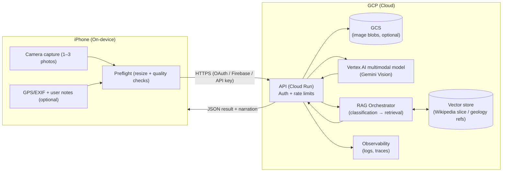

# Camera → Geology (iPhone → Vertex AI) Architecture Notes

Picture this as a roadside stop where the user points an iPhone at an outcrop and asks, “What am I looking at?” The system’s job is not to *declare* the one true rock, but to offer a well‑behaved short list of plausible IDs, explain what it sees, and (when it’s unsure) ask for the next photo that would reduce ambiguity.

This doc sketches an architecture that fits the current repo direction (Wikipedia‑grounded, small slices first) while leaving room for more geoscience‑specific sources later.

## Mile 0: What we’re trying to do

**Input**
- One or more photos (wide shot + close‑up), ideally with a scale reference.
- Optional metadata: GPS (with user consent), compass heading, timestamp, short user note (“roadcut on I‑81 near Roanoke”).

**Output**
- A **structured** classification result:
  - top hypotheses (rock types / features) with confidence
  - “what I see” notes (texture, layering, fracture patterns)
  - follow‑up questions and photo requests (to resolve uncertainty)
  - citations for background/explanations (initially Wikipedia; later USGS/field guides)
- A readable narration that stays grounded in the structured result.

**Non‑goals**
- Safety‑critical decisions (slope stability, rockfall risk, route safety).
- “Guaranteed” identification from a single photo.

## Mile 1: A cloud‑first reference architecture

This version keeps the phone thin: it captures images, does light preflight, and calls a backend that talks to Vertex AI.

### Request/response shape (backend contract)

Keep the API payloads boring and explicit. The “narration” is UI sugar; the structured output is the product.

**Request (conceptual)**
- `images[]`: JPEG/HEIC bytes (or signed URLs after upload)
- `location`: `{ lat, lng, accuracy_m }` (optional)
- `context`: `{ corridor: "I-81", note: "roadcut near Roanoke" }` (optional)
- `preferences`: `{ store_images: false }` (optional)

**Response (conceptual)**
- `hypotheses[]`: rock/material candidates with `confidence`, `why`
- `features[]`: visible structures (bedding, foliation, joints, folds, etc.)
- `follow_up`: questions + photo requests (close‑up, wet surface, scale object)
- `citations[]`: sources backing the explanation
- `narration`: a short paragraph the UI can read aloud

## Mile 2: Where “agentic Wikipedia” fits

The vision model can propose candidates (“looks like shale/sandstone; layered bedding”), but the **grounding** comes from retrieval:

1) **Vision → candidates** (multimodal model):
   - propose top‑k rock/material hypotheses and visible features
2) **Candidates → queries** (LLM/tooling):
   - generate Wikipedia queries like `Shale`, `Sedimentary rock`, `Appalachian Mountains geology`, `Valley and Ridge`
3) **Retrieve → citations** (your existing pipeline):
   - load a small slice of pages, embed, retrieve top passages
4) **Synthesize → explain**:
   - produce a narrated explanation that references retrieved sources

This separation helps with hallucination control: the model is allowed to *suggest*, but it must *support*.

## Mile 3: Hybrid option (on‑device first pass)

If you want lower latency, better privacy, or offline support, add an on‑device classifier:

- **On‑device**: a small CoreML model to do coarse labels (igneous/sedimentary/metamorphic, “layered vs massive”, etc.) and quality checks (“too dark”, “out of focus”).
- **Cloud**: multimodal model only when the user asks for detail or wants citations.

This can reduce cost and keep photos local by default.

## Mile 4: Guardrails, calibration, and “don’t overpromise”

Rock ID from images is inherently uncertain. Design for that uncertainty:

- Return **top‑k** hypotheses, not a single answer.
- Ask for the next best photo:
  - wide shot for context + close‑up for texture
  - include a coin/pen for scale
  - shoot in shade and sun if glare is an issue
- Use location only as a *soft prior* (and only with consent).
- Prefer wording like “likely / consistent with / could be” unless confidence is truly high.

## Mile 5: Privacy and data handling

Decide early what you keep:

- Default to **not storing** user photos; store only derived results if possible.
- If storing images for debugging/training:
  - make it opt‑in
  - strip EXIF unless the user explicitly shares location
  - set retention windows and deletion controls

## Mile 6: Practical next steps (POC)

1) iPhone capture prototype:
   - wide + close‑up capture flow, plus “add scale reference” UX
2) Backend endpoint:
   - accepts image + optional location, returns structured JSON
3) Prompt + schema:
   - force multimodal output into a predictable contract (see `docs/vision_prompt_schema.md`)
4) Evaluation set:
   - collect ~50 labeled images (even coarse labels) to measure accuracy and calibration

