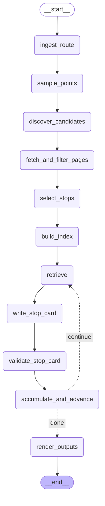

# Route Guide Graph - Mermaid

Generated from `naturalist_companion.route_guide.build_route_guide_app()`.

```mermaid
graph TD;
	__start__([<p>__start__</p>]):::first
	ingest_route(ingest_route)
	sample_points(sample_points)
	discover_candidates(discover_candidates)
	fetch_and_filter_pages(fetch_and_filter_pages)
	select_stops(select_stops)
	build_index(build_index)
	retrieve(retrieve)
	write_stop_card(write_stop_card)
	validate_stop_card(validate_stop_card)
	accumulate_and_advance(accumulate_and_advance)
	render_outputs(render_outputs)
	__end__([<p>__end__</p>]):::last
	__start__ --> ingest_route;
	accumulate_and_advance -. &nbsp;done&nbsp; .-> render_outputs;
	accumulate_and_advance -. &nbsp;continue&nbsp; .-> retrieve;
	build_index --> retrieve;
	discover_candidates --> fetch_and_filter_pages;
	fetch_and_filter_pages --> select_stops;
	ingest_route --> sample_points;
	retrieve --> write_stop_card;
	sample_points --> discover_candidates;
	select_stops --> build_index;
	validate_stop_card --> accumulate_and_advance;
	write_stop_card --> validate_stop_card;
	render_outputs --> __end__;
	classDef default fill:#f2f0ff,line-height:1.2
	classDef first fill-opacity:0
	classDef last fill:#bfb6fc
```
